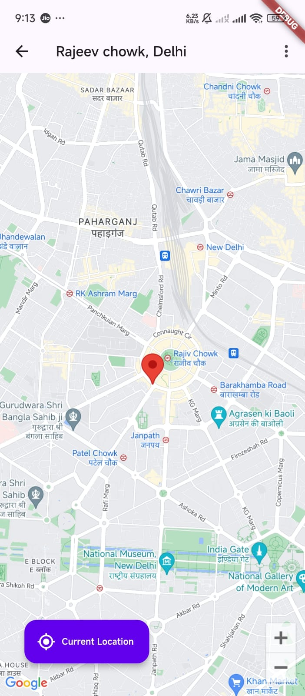
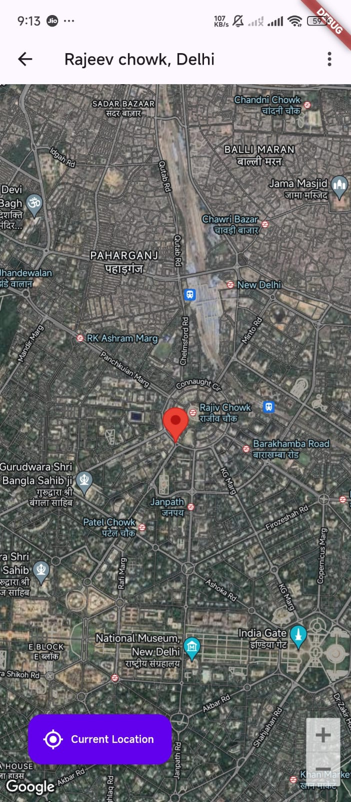

 # Place Finder

A Flutter application that allows users to find and display locations on a map using Google Maps. The app supports user input for locations and can also fetch the user's current location.

## Features

- Search for locations using an input field.
- Display the selected location on a Google Map.
- Fetch and display the user's current location on the map.
- Change map types (Normal, Satellite, Terrain, Hybrid).
- Use of provider for state management.
- flushbar for error message.

## Screenshots






## Technologies Used

- Flutter
- Google Maps Flutter Package
- Geocoding Package
- Geolocator Package
- Provider Package
- flushbar Content Package
-  permission_handler package
- page_transition package
- flutter_screenutil package

## Installation

1. Clone the repository:
   ```bash
   git clone https://github.com/your_username/place_finder.git
   cd place_finder
2. Install dependencies:
   ```bash
   flutter pub get

## Get a Google Maps API key:
- Visit the Google Cloud Console.
- Create a new project.
- Enable the Maps SDK for Android and iOS.
- Create credentials (API key).

3. Run the app:
   ```bash
   flutter run

##  Usage
- Launch the app.
- Enter a location in the input field and press "Show Me" to display the location on the map.
- Enable the Maps SDK for Android and iOS.
- Create credentials (API key). 

##  Acknowledgments
- Flutter
- Google Maps Platform
- Geolocator
- Geocoding
- Provider

    


